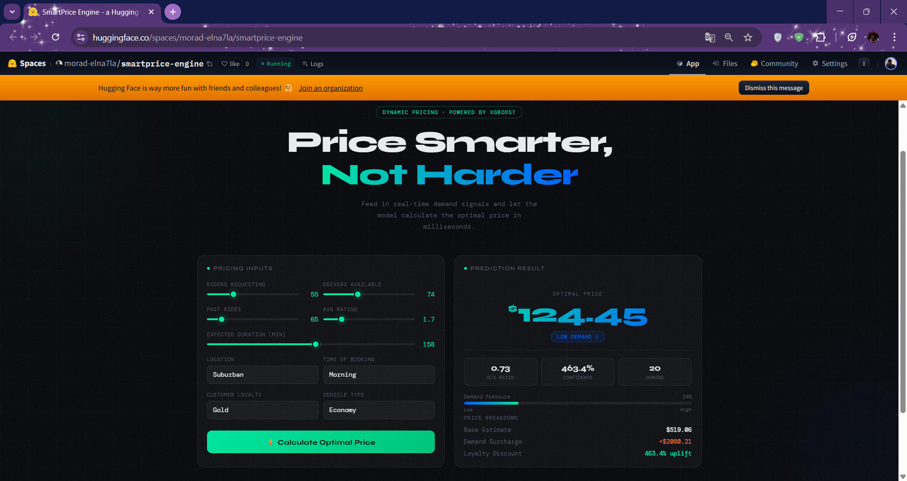

# ⚡ SmartPrice Engine

<div align="center">



## 🌐 Live Demo  👉 **[https://huggingface.co/spaces/morad-elna7la/smartprice-engine](https://huggingface.co/spaces/morad-elna7la/smartprice-engine)**

<br/>

[](https://huggingface.co/spaces/morad-elna7la/smartprice-engine)
[](https://python.org)
[](https://fastapi.tiangolo.com)
[](https://xgboost.readthedocs.io)
[](https://docker.com)

<br/>

> **A production-grade Dynamic Pricing API** that predicts the optimal ride price in real-time based on demand, supply, customer loyalty, and contextual signals — deployed on Hugging Face Spaces via Docker.

</div>

---

## 🧠 The Problem

Most ride-hailing and e-commerce platforms either **underprice** (leaving revenue on the table) or **overprice** (losing customers). Manual pricing rules can't adapt to real-time demand fluctuations.

**SmartPrice Engine solves this** by using machine learning to calculate the optimal price dynamically — balancing revenue maximization and customer fairness.

---

## 📊 Model Performance

| Metric | Value |
|--------|-------|
| **R²** | 0.8326 |
| **MAE** | $59.12 |
| **RMSE** | $78.12 |
| **MAPE** | 18.58% |
| **CV R² (5-fold)** | 0.846 ± 0.017 |

> Trained on [Dynamic Pricing Dataset](https://www.kaggle.com/datasets/arashnic/dynamic-pricing-dataset) — 1,000 rides with 10 features.  
> CV R² of **0.846** confirms the model generalizes well with no overfitting.

---

## 🏗️ Architecture

```
┌─────────────────────────────────────────────────┐
│                  Client (Browser)               │
│              Static UI — index.html             │
└──────────────────────┬──────────────────────────┘
                       │ POST /predict
┌──────────────────────▼──────────────────────────┐
│              FastAPI Backend                    │
│         Input validation (Pydantic)             │
│         Feature engineering                     │
│         StandardScaler → XGBoost               │
└──────────────────────┬──────────────────────────┘
                       │
┌──────────────────────▼──────────────────────────┐
│           XGBoost Regressor                     │
│   model.joblib / scaler.joblib / le_vehicle     │
│   → predicted_price + demand_level + breakdown  │
└─────────────────────────────────────────────────┘
```

---

## ✨ Features

- 🎯 **Real-time price prediction** via REST API
- 📈 **Demand/Supply ratio** as engineered feature
- 🏷️ **Price level classification** — High Demand / Normal / Low Demand
- 💳 **Loyalty discount** logic for Gold customers
- 🌐 **World-class dark UI** — no frameworks, pure HTML/CSS/JS
- 🐳 **Dockerized** and deployed on Hugging Face Spaces
- 📓 **Full EDA notebook** with dark-themed visualizations

---

## 🔌 API

### `POST /predict`

```bash
curl -X POST https://morad-elna7la-smartprice-engine.hf.space/predict \
  -H "Content-Type: application/json" \
  -d '{
    "number_of_riders": 80,
    "number_of_drivers": 20,
    "number_of_past_rides": 10,
    "average_ratings": 4.5,
    "expected_ride_duration": 45,
    "location_category": "Urban",
    "customer_loyalty": "Gold",
    "vehicle_type": "Premium",
    "time_of_booking": "Evening"
  }'
```

**Response:**
```json
{
  "predicted_price": 312.45,
  "demand_supply_ratio": 3.81,
  "price_level": "High Demand",
  "confidence": "High",
  "breakdown": {
    "base_estimate": 187.47,
    "demand_surcharge": 78.11,
    "loyalty_discount": 46.87
  }
}
```

### Input Fields

| Field | Type | Options |
|---|---|---|
| `number_of_riders` | int | 1 – 200 |
| `number_of_drivers` | int | 1 – 200 |
| `number_of_past_rides` | int | 0 – 500 |
| `average_ratings` | float | 1.0 – 5.0 |
| `expected_ride_duration` | int | 1 – 300 min |
| `location_category` | string | `Urban` / `Suburban` / `Rural` |
| `customer_loyalty` | string | `Silver` / `Regular` / `Gold` |
| `vehicle_type` | string | `Economy` / `Premium` |
| `time_of_booking` | string | `Morning` / `Afternoon` / `Evening` / `Night` |

---

## 📁 Project Structure

```
smartprice-engine/
│
├── app/
│   ├── main.py              ← FastAPI app + /predict endpoint
│   └── optimizer.py         ← Price optimization logic
│
├── models/
│   ├── train.py             ← XGBoost training pipeline
│   ├── model.joblib         ← Trained model (Git LFS)
│   ├── scaler.joblib        ← StandardScaler (Git LFS)
│   └── le_vehicle.joblib    ← LabelEncoder (Git LFS)
│
├── notebooks/
│   ├── EDA_and_Training.ipynb       ← Full EDA + model training
│   └── optimization_layer.ipynb    ← Price optimization analysis
│
├── static/
│   └── index.html           ← Frontend UI
│
├── image/
│   └── app.png              ← App screenshot
│
├── Dockerfile               ← Docker config for HF Spaces
├── requirements.txt
└── run.py                   ← Local runner (train + serve)
```

---

## 🚀 Run Locally

```bash
# 1. Clone
git clone https://github.com/morad-elnahla/smartprice-engine.git
cd smartprice-engine

# 2. Install
pip install -r requirements.txt

# 3. Download dataset → place at data/dynamic_pricing.csv
#    https://www.kaggle.com/datasets/arashnic/dynamic-pricing-dataset

# 4. Train + Serve
python run.py
```

Open **http://localhost:8000**

---

## 🐳 Docker

```bash
# After running python run.py once (to generate model files)
docker build -t smartprice .
docker run -p 7860:7860 smartprice
```

---

## 🛠️ Tech Stack

| Layer | Technology |
|---|---|
| **Model** | XGBoost Regressor |
| **Backend** | FastAPI + Pydantic + Uvicorn |
| **Frontend** | HTML / CSS / Vanilla JS |
| **Serving** | Docker |
| **Deployment** | Hugging Face Spaces |
| **EDA** | Pandas, Matplotlib, Seaborn |


## 👤 Author

**Morad Elnahla** — Machine Learning Engineer  
[](https://github.com/morad-elnahla)
[](https://huggingface.co/morad-elna7la)
